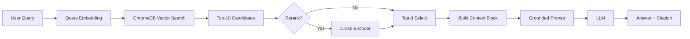

# Architecture — RAG Pipeline (Day 08 Lab)

> Template: Điền vào các mục này khi hoàn thành từng sprint.
> Deliverable của Documentation Owner.

## 1. Tổng quan kiến trúc

```
[Raw Docs]
    ↓
[index.py: Preprocess → Chunk → Embed → Store]
    ↓
[ChromaDB Vector Store]
    ↓
[rag_answer.py: Query → Retrieve → Rerank → Generate]
    ↓
[Grounded Answer + Citation]
```

**Mô tả ngắn gọn:**
Nhóm xây một trợ lý hỏi đáp nội bộ cho CS + IT Helpdesk dựa trên mô hình RAG.
Pipeline nhận câu hỏi nghiệp vụ, truy xuất bằng chứng từ policy/SLA/SOP nội bộ, rồi sinh câu trả lời ngắn gọn kèm citation nguồn.
Thiết kế ưu tiên grounded answer (evidence-only) để giảm hallucination khi dùng trong môi trường vận hành.

---

## 2. Indexing Pipeline (Sprint 1)

### Tài liệu được index
| File | Nguồn | Department | Số chunk |
|------|-------|-----------|---------|
| `policy_refund_v4.txt` | policy/refund-v4.pdf | CS | tự động khi chạy `build_index()` |
| `sla_p1_2026.txt` | support/sla-p1-2026.pdf | IT | tự động khi chạy `build_index()` |
| `access_control_sop.txt` | it/access-control-sop.md | IT Security | tự động khi chạy `build_index()` |
| `it_helpdesk_faq.txt` | support/helpdesk-faq.md | IT | tự động khi chạy `build_index()` |
| `hr_leave_policy.txt` | hr/leave-policy-2026.pdf | HR | tự động khi chạy `build_index()` |

### Quyết định chunking
| Tham số | Giá trị | Lý do |
|---------|---------|-------|
| Chunk size | 400 tokens (~1600 chars) | Cân bằng giữa đủ ngữ cảnh và tránh context quá dài |
| Overlap | 80 tokens (~320 chars) | Giảm mất mạch thông tin ở ranh giới chunk |
| Chunking strategy | Heading-based + paragraph-first | Bám cấu trúc văn bản tự nhiên, giảm cắt giữa điều khoản |
| Metadata fields | source, section, effective_date, department, access | Phục vụ filter, freshness, citation |

### Embedding model
- **Model**: TODO (OpenAI text-embedding-3-small / paraphrase-multilingual-MiniLM-L12-v2)
- **Model**: OpenAI `text-embedding-3-small` (nếu có API key) hoặc local `paraphrase-multilingual-MiniLM-L12-v2` (fallback)
- **Vector store**: ChromaDB (PersistentClient)
- **Similarity metric**: Cosine

---

## 3. Retrieval Pipeline (Sprint 2 + 3)

### Baseline (Sprint 2)
| Tham số | Giá trị |
|---------|---------|
| Strategy | Dense (embedding similarity) |
| Top-k search | 10 |
| Top-k select | 3 |
| Rerank | Không |

### Variant (Sprint 3)
| Tham số | Giá trị | Thay đổi so với baseline |
|---------|---------|------------------------|
| Strategy | Hybrid (Dense + Sparse/BM25) | Thêm sparse branch + RRF fusion |
| Top-k search | 10 | Giữ nguyên để A/B fair |
| Top-k select | 3 | Giữ nguyên để A/B fair |
| Rerank | Lexical rerank (mặc định), optional cross-encoder | Có thể bật `RERANK_WITH_CROSS_ENCODER=1` |
| Query transform | Chưa bật mặc định | Tránh đổi quá nhiều biến cùng lúc |

**Lý do chọn variant này:**
Chọn hybrid vì bộ tài liệu chứa cả ngôn ngữ tự nhiên (policy/HR) và keyword chuyên biệt (P1, Level 3, mã lỗi, alias tài liệu).
Dense retrieval tốt cho ngữ nghĩa, nhưng dễ hụt exact-term/alias; BM25 bù vào phần keyword exact match.
Kết hợp bằng RRF giúp tăng recall mà vẫn ổn định top-k context cho grounded prompt.

---

## 4. Generation (Sprint 2)

### Grounded Prompt Template
```
Answer only from the retrieved context below.
If the context is insufficient, say you do not know.
Cite the source field when possible.
Keep your answer short, clear, and factual.

Question: {query}

Context:
[1] {source} | {section} | score={score}
{chunk_text}

[2] ...

Answer:
```

### LLM Configuration
| Tham số | Giá trị |
|---------|---------|
| Model | `gpt-4o-mini` (OpenAI) hoặc `gemini-1.5-flash` (Gemini) |
| Temperature | 0 (để output ổn định cho eval) |
| Max tokens | 512 |

---

## 5. Failure Mode Checklist

> Dùng khi debug — kiểm tra lần lượt: index → retrieval → generation

| Failure Mode | Triệu chứng | Cách kiểm tra |
|-------------|-------------|---------------|
| Index lỗi | Retrieve về docs cũ / sai version | `inspect_metadata_coverage()` trong index.py |
| Chunking tệ | Chunk cắt giữa điều khoản | `list_chunks()` và đọc text preview |
| Retrieval lỗi | Không tìm được expected source | `score_context_recall()` trong eval.py |
| Generation lỗi | Answer không grounded / bịa | `score_faithfulness()` trong eval.py |
| Token overload | Context quá dài → lost in the middle | Kiểm tra độ dài context_block |

---

## 6. Diagram (tùy chọn)

> TODO: Vẽ sơ đồ pipeline nếu có thời gian. Có thể dùng Mermaid hoặc drawio.


